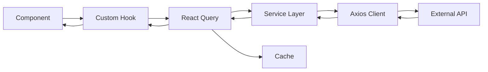

## Overview

Villa Buena implements a clean separation between API communication and UI components through a layered architecture:

<Steps>
  <Step title="Axios Client">
    Configured HTTP client with base URL from environment variables
  </Step>
  <Step title="Service Layer">
    Domain-specific service modules that encapsulate API calls
  </Step>
  <Step title="Custom Hooks">
    React Query hooks that provide caching, refetching, and state management
  </Step>
  <Step title="Components">
    UI components consume hooks without direct API knowledge
  </Step>
</Steps>

## Axios Configuration

The base API client is configured in `src/services/api.js:3-5`:

```javascript
import axios from "axios";

export const api = axios.create({
  baseURL: import.meta.env.VITE_API_URL,
});
```

### Environment Variables

The API URL is loaded from Vite environment variables, allowing different configurations per environment:

```bash
# .env.development
VITE_API_URL=https://api.escuelajs.co/api/v1

# .env.production
VITE_API_URL=https://production-api.example.com/api/v1
```

<Note>
Vite environment variables must be prefixed with `VITE_` to be exposed to client-side code. Access them via `import.meta.env.VITE_*`.
</Note>

### Axios Instance Benefits

<CardGroup cols={2}>
  <Card title="Centralized Config" icon="gear">
    All requests automatically use the base URL
  </Card>
  <Card title="Interceptors" icon="shield">
    Easily add auth tokens, error handling, or logging
  </Card>
  <Card title="Custom Defaults" icon="sliders">
    Set timeout, headers, and other defaults
  </Card>
  <Card title="Testability" icon="vial">
    Mock the instance for testing without affecting global axios
  </Card>
</CardGroup>

## Service Layer

The service layer abstracts API communication into reusable modules. The `productService` (`src/services/productService.js`) demonstrates this pattern:

```javascript
import { api } from "./api";

export const productService = {
  getAll: async () => {
    const { data } = await api.get("/products?limit=200");
    return data;
  },
  
  getById: async (id) => {
    const { data } = await api.get(`/products/${id}`);
    return data;
  },
  
  getByCategory: async (category) => {
    const { data } = await api.get(`/products/category/${category}`);
    return data;
  },
};
```

### Service Layer Benefits

<Steps>
  <Step title="Single Responsibility">
    Each service module handles one domain (products, users, orders, etc.)
  </Step>
  
  <Step title="API Abstraction">
    Components don't need to know about endpoints, HTTP methods, or response structures
  </Step>
  
  <Step title="Reusability">
    Services can be used across multiple hooks and components
  </Step>
  
  <Step title="Testability">
    Easy to mock service methods in component tests
  </Step>
</Steps>

### API Endpoints

The product service exposes three methods:

| Method | Endpoint | Description |
|--------|----------|-------------|
| `getAll()` | `GET /products?limit=200` | Fetch all products (max 200) |
| `getById(id)` | `GET /products/:id` | Fetch single product by ID |
| `getByCategory(category)` | `GET /products/category/:category` | Fetch products in category |

<Tip>
The `getAll` method includes a query parameter `?limit=200` to fetch a larger dataset from the API.
</Tip>

## React Query Integration

React Query (TanStack Query v5) provides powerful server state management with automatic caching, background refetching, and optimistic updates.

### Query Provider Setup

The QueryClient is configured in `src/app/providers/QueryProvider.jsx:1-8`:

```javascript
import { QueryClient, QueryClientProvider } from "@tanstack/react-query";

const queryClient = new QueryClient();

export const QueryProvider = ({ children }) => {
  return (
    <QueryClientProvider client={queryClient}>{children}</QueryClientProvider>
  );
};
```

This provider wraps the entire application in `main.jsx:14`, making React Query available to all components.

### Custom React Query Hooks

The `useProducts` hook module (`src/hooks/useProducts.js`) combines React Query with the product service:

```javascript
import { useQuery } from "@tanstack/react-query";
import { productService } from "../services/productService";

export const useProducts = () => {
  return useQuery({
    queryKey: ["products"],
    queryFn: productService.getAll,
  });
};

export const useProduct = (id) => {
  return useQuery({
    queryKey: ["product", id],
    queryFn: () => productService.getById(id),
    enabled: !!id,
  });
};

export const useProductsByCategory = (category) => {
  return useQuery({
    queryKey: ["products", "category", category],
    queryFn: () => productService.getByCategory(category),
    enabled: !!category,
  });
};
```

### Query Key Strategy

React Query uses query keys for caching and invalidation:

```javascript
// Simple key for all products
queryKey: ["products"]

// Hierarchical key for single product
queryKey: ["product", id]

// Nested key for category filtering
queryKey: ["products", "category", category]
```

<Note>
Query keys should be arrays that uniquely identify the data. Include all variables that affect the query (like `id` or `category`) in the key.
</Note>

### Conditional Fetching

Both `useProduct` and `useProductsByCategory` use the `enabled` option to prevent fetching until required parameters are available:

```javascript
enabled: !!id  // Only fetch when id is truthy
enabled: !!category  // Only fetch when category is truthy
```

This prevents unnecessary API calls and errors from invalid parameters.

## Using Hooks in Components

### Fetching All Products

```jsx
import { useProducts } from '../hooks/useProducts';

function ProductList() {
  const { data: products, isLoading, error } = useProducts();
  
  if (isLoading) return <div>Loading products...</div>;
  if (error) return <div>Error: {error.message}</div>;
  
  return (
    <div>
      {products.map(product => (
        <ProductCard key={product.id} product={product} />
      ))}
    </div>
  );
}
```

### Fetching Single Product

```jsx
import { useParams } from 'react-router-dom';
import { useProduct } from '../hooks/useProducts';

function ProductDetail() {
  const { id } = useParams();
  const { data: product, isLoading, error } = useProduct(id);
  
  if (isLoading) return <div>Loading...</div>;
  if (error) return <div>Error loading product</div>;
  
  return (
    <div>
      <h1>{product.title}</h1>
      <p>{product.description}</p>
      <p>${product.price}</p>
    </div>
  );
}
```

### React Query Return Values

| Property | Type | Description |
|----------|------|-------------|
| `data` | `any` | The fetched data (undefined until loaded) |
| `isLoading` | `boolean` | True during initial fetch |
| `isFetching` | `boolean` | True during any fetch (including background) |
| `error` | `Error \| null` | Error object if fetch failed |
| `isError` | `boolean` | True if query is in error state |
| `refetch` | `function` | Manually trigger a refetch |

## Caching and Refetching

React Query automatically manages cache and refetching:

<Steps>
  <Step title="Automatic Caching">
    Query results are cached by their query key. Subsequent requests return cached data instantly.
  </Step>
  
  <Step title="Background Refetching">
    When the window regains focus, React Query refetches to ensure fresh data.
  </Step>
  
  <Step title="Stale Time">
    Configure how long data is considered fresh before triggering background updates.
  </Step>
  
  <Step title="Cache Time">
    Control how long unused data stays in cache before garbage collection.
  </Step>
</Steps>

### Configuring Cache Behavior

```javascript
const queryClient = new QueryClient({
  defaultOptions: {
    queries: {
      staleTime: 5 * 60 * 1000, // 5 minutes
      cacheTime: 10 * 60 * 1000, // 10 minutes
      refetchOnWindowFocus: true,
      refetchOnReconnect: true,
    },
  },
});
```

## Error Handling

Handle errors gracefully in components:

```jsx
function ProductList() {
  const { data, isLoading, error, isError } = useProducts();
  
  if (isLoading) {
    return <LoadingSpinner />;
  }
  
  if (isError) {
    return (
      <div className="alert alert-danger">
        <h4>Failed to load products</h4>
        <p>{error.message}</p>
        <button onClick={() => refetch()}>Retry</button>
      </div>
    );
  }
  
  return <ProductGrid products={data} />;
}
```

<Tip>
React Query provides `retry` options to automatically retry failed requests with exponential backoff.
</Tip>

## Mutations (Future)

While the current codebase only implements queries, React Query also supports mutations for POST/PUT/DELETE operations:

```javascript
import { useMutation, useQueryClient } from '@tanstack/react-query';

function useCreateProduct() {
  const queryClient = useQueryClient();
  
  return useMutation({
    mutationFn: (newProduct) => productService.create(newProduct),
    onSuccess: () => {
      // Invalidate and refetch products
      queryClient.invalidateQueries({ queryKey: ['products'] });
    },
  });
}
```

## Architecture Diagram



## Best Practices

<Steps>
  <Step title="Keep Services Pure">
    Service methods should only handle HTTP communication, not state management or business logic.
  </Step>
  
  <Step title="Use Query Keys Wisely">
    Include all variables that affect the query result in the query key for proper cache invalidation.
  </Step>
  
  <Step title="Handle Loading States">
    Always provide feedback during loading and error states for better UX.
  </Step>
  
  <Step title="Leverage Cache">
    Trust React Query's caching to reduce unnecessary API calls and improve performance.
  </Step>
  
  <Step title="Centralize Configuration">
    Keep API configuration (base URL, timeouts, headers) in the axios instance.
  </Step>
</Steps>

## Testing

### Mocking Services

```javascript
// __mocks__/productService.js
export const productService = {
  getAll: jest.fn(() => Promise.resolve(mockProducts)),
  getById: jest.fn((id) => Promise.resolve(mockProducts[0])),
};
```

### Testing with React Query

```jsx
import { QueryClient, QueryClientProvider } from '@tanstack/react-query';
import { render, screen } from '@testing-library/react';

const createTestQueryClient = () => new QueryClient({
  defaultOptions: {
    queries: { retry: false },
  },
});

test('renders product list', async () => {
  const queryClient = createTestQueryClient();
  
  render(
    <QueryClientProvider client={queryClient}>
      <ProductList />
    </QueryClientProvider>
  );
  
  expect(await screen.findByText('Product Name')).toBeInTheDocument();
});
```

<Note>
Disable retries in test environments to make tests faster and more predictable.
</Note>