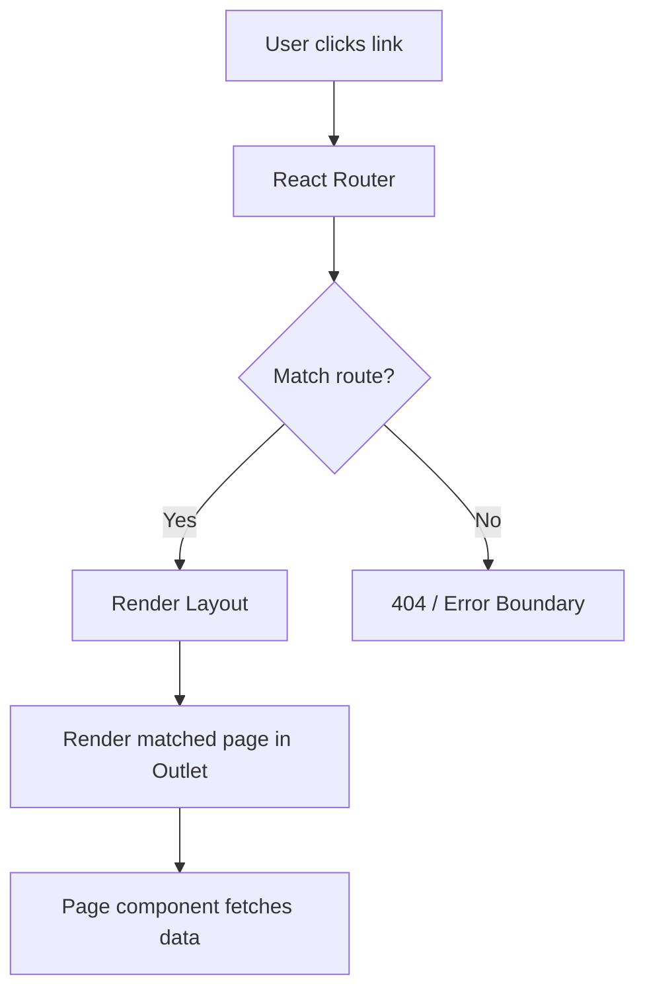

## Overview

Villa Buena uses **React Router DOM v7.13.1** with the modern `createBrowserRouter` API for type-safe, data-driven routing. The application implements nested routes with a shared layout component.

## Router Configuration

The router is defined in `src/app/router.jsx:12-27` using the new router API:

```jsx
import { createBrowserRouter } from "react-router-dom";
import { Home } from "../pages/Home";
import { ProductDetail } from "../pages/productDetail/ProductDetail";
import { Cart } from "../pages/cart/Cart";
import { CheckoutShipping } from "../pages/checkoutShipping/CheckoutShipping";
import { CheckoutPayment } from "../pages/checkoutpayment/CheckoutPayment";
import { PaymentSuccess } from "../pages/paymentSuccess/PaymentSuccess";
import { AccountPage } from "../pages/account/AccountPage";
import { OrderHistory } from "../pages/orders/OrderHistory";
import { Layout } from "./layout";

export const router = createBrowserRouter([
  {
    path: "/",
    element: <Layout />,
    children: [
      { index: true, element: <Home /> },
      { path: "product/:id", element: <ProductDetail /> },
      { path: "cart", element: <Cart /> },
      { path: "checkout/shipping", element: <CheckoutShipping /> },
      { path: "checkout/payment", element: <CheckoutPayment /> },
      { path: "payment/success", element: <PaymentSuccess /> },
      { path: "account", element: <AccountPage /> },
      { path: "orders", element: <OrderHistory /> },
    ],
  },
]);
```

<Note>
The `createBrowserRouter` API provides better support for data loading, error boundaries, and optimistic UI updates compared to the legacy `BrowserRouter` component.
</Note>

## Route Structure

The application follows a hierarchical route structure:

<Steps>
  <Step title="Root Layout Route">
    The root path `/` renders the `Layout` component which provides the shared UI shell (navbar, toast, cart drawer).
  </Step>
  
  <Step title="Nested Child Routes">
    All page routes are nested under the layout, automatically inheriting the shared navigation and UI components.
  </Step>
  
  <Step title="Outlet Rendering">
    The Layout component uses `<Outlet />` to render the matched child route.
  </Step>
</Steps>

## Route Definitions

### Index Route

```jsx
{ index: true, element: <Home /> }
```

The index route renders the home page at the root path `/`. This is equivalent to defining `path: "/"` but explicitly marks it as the default child route.

### Dynamic Product Route

```jsx
{ path: "product/:id", element: <ProductDetail /> }
```

The `:id` parameter enables dynamic routing for individual product pages. Access the parameter using the `useParams` hook:

```jsx
import { useParams } from 'react-router-dom';

function ProductDetail() {
  const { id } = useParams();
  // id contains the URL parameter value
}
```

### Checkout Flow Routes

```jsx
{ path: "checkout/shipping", element: <CheckoutShipping /> },
{ path: "checkout/payment", element: <CheckoutPayment /> },
{ path: "payment/success", element: <PaymentSuccess /> }
```

These routes implement a multi-step checkout process:

<CardGroup cols={3}>
  <Card title="Step 1: Shipping" icon="truck">
    `/checkout/shipping` - Collect shipping information
  </Card>
  <Card title="Step 2: Payment" icon="credit-card">
    `/checkout/payment` - Process payment details
  </Card>
  <Card title="Step 3: Success" icon="circle-check">
    `/payment/success` - Confirmation screen
  </Card>
</CardGroup>

### User Account Routes

```jsx
{ path: "account", element: <AccountPage /> },
{ path: "orders", element: <OrderHistory /> }
```

Protected routes for authenticated user functionality.

## Layout Component

The Layout component (`src/app/Layout.jsx`) provides the shared UI structure:

```jsx
import { Outlet } from "react-router-dom";
import Navbar from "../components/navbar/Navbar";
import { useUIStore } from "../store/uiStore";
import { useEffect } from "react";
import Toast from "../components/toast/Toast";
import { CartDrawer } from "../components/cart/CartDrawer";

export const Layout = () => {
  const darkMode = useUIStore((state) => state.darkMode);

  useEffect(() => {
    document.body.classList.remove("light-mode", "dark-mode");
    document.body.classList.add(darkMode ? "dark-mode" : "light-mode");
  }, [darkMode]);
  
  return (
    <>
      <Toast />
      <Navbar />
      <CartDrawer />
      <Outlet />
    </>
  );
};
```

### Layout Responsibilities

<Steps>
  <Step title="Global UI Components">
    Renders navbar, toast notifications, and cart drawer that persist across route changes.
  </Step>
  
  <Step title="Dark Mode Management">
    Applies dark/light mode classes to the document body based on Zustand store state.
  </Step>
  
  <Step title="Route Outlet">
    The `<Outlet />` component (`Layout.jsx:20`) renders the matched child route component.
  </Step>
</Steps>

<Tip>
Using a layout route eliminates the need to import and render Navbar/Toast in every page component, following the DRY principle.
</Tip>

## Router Provider Integration

The router is integrated at the application root in `main.jsx:22`:

```jsx
import { RouterProvider } from "react-router-dom";
import { router } from "./app/router";

ReactDOM.createRoot(document.getElementById("root")).render(
  <QueryProvider>
    <Auth0Provider
      domain="dev-rafaelval.us.auth0.com"
      clientId="ripKJ8Jjq1c3gLEOcusOGUTBTFVGoVdG"
      authorizationParams={{ redirect_uri: window.location.origin }}
      onRedirectCallback={onRedirectCallback}
      cacheLocation="localstorage"
    >
      <RouterProvider router={router} />
    </Auth0Provider>
  </QueryProvider>,
);
```

## Navigation Patterns

### Programmatic Navigation

Use the `useNavigate` hook for programmatic route changes:

```jsx
import { useNavigate } from 'react-router-dom';

function CheckoutButton() {
  const navigate = useNavigate();
  
  const handleCheckout = () => {
    // Perform validation
    navigate('/checkout/shipping');
  };
  
  return <button onClick={handleCheckout}>Proceed to Checkout</button>;
}
```

### Declarative Navigation

Use the `Link` or `NavLink` component for declarative navigation:

```jsx
import { Link } from 'react-router-dom';

<Link to="/cart">View Cart</Link>
<Link to={`/product/${productId}`}>View Product</Link>
```

### Auth0 Redirect Callback

The application handles Auth0 redirects using a custom callback (`main.jsx:9-11`):

```javascript
const onRedirectCallback = (appState) => {
  router.navigate(appState?.returnTo ?? window.location.pathname);
};
```

This ensures users return to their intended destination after authentication.

<Note>
The router instance is accessed directly via `router.navigate()` instead of using the hook, since this callback runs outside the React component tree.
</Note>

## Route Organization Best Practices

<Steps>
  <Step title="Collocate Related Routes">
    Group related routes (e.g., checkout steps) under a common path prefix for clarity.
  </Step>
  
  <Step title="Use Nested Routes">
    Leverage nested routes and layouts to share UI components and reduce code duplication.
  </Step>
  
  <Step title="Lazy Loading">
    For larger applications, use `React.lazy()` to code-split route components:
    ```jsx
    const ProductDetail = lazy(() => import('../pages/productDetail/ProductDetail'));
    ```
  </Step>
  
  <Step title="Error Boundaries">
    Add error boundaries to route definitions for better error handling:
    ```jsx
    {
      path: "/",
      element: <Layout />,
      errorElement: <ErrorPage />,
      children: [...]
    }
    ```
  </Step>
</Steps>

## Routing Flow



## URL Parameters

The product detail route demonstrates dynamic parameter usage:

```jsx
// Route definition
{ path: "product/:id", element: <ProductDetail /> }

// Component implementation
import { useParams } from 'react-router-dom';
import { useProduct } from '../../hooks/useProducts';

function ProductDetail() {
  const { id } = useParams();
  const { data: product, isLoading } = useProduct(id);
  
  // Render product details
}
```

<Tip>
Combine `useParams` with React Query hooks to automatically fetch data based on URL parameters. React Query will cache and refetch as needed.
</Tip>

## Future Enhancements

Potential routing improvements:

- **Route Guards**: Implement authentication guards for protected routes
- **Data Loaders**: Use React Router's `loader` function for prefetching data
- **Actions**: Implement form submissions using React Router `action` functions
- **Breadcrumbs**: Generate automatic breadcrumbs from route hierarchy
- **Scroll Restoration**: Preserve scroll position across navigation