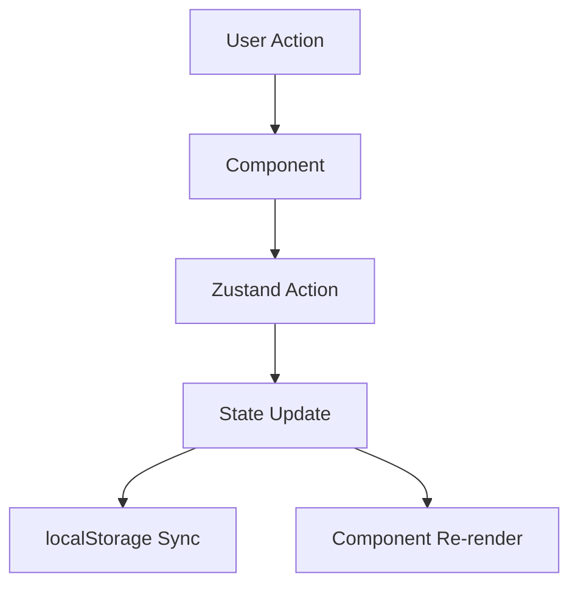

## Overview

Villa Buena uses **Zustand** for client-side state management, chosen for its simplicity, minimal boilerplate, and excellent TypeScript support. All stores use the `persist` middleware to sync with localStorage.

<Note>
Zustand provides a lightweight alternative to Redux with a hooks-based API that feels natural in React applications.
</Note>

## Store Architecture

The application has three primary stores, each managing a distinct domain:

<CardGroup cols={3}>
  <Card title="Cart Store" icon="shopping-cart">
    Shopping cart items and quantities
  </Card>
  <Card title="User Store" icon="user">
    Checkout data and order history
  </Card>
  <Card title="UI Store" icon="eye">
    UI preferences and transient state
  </Card>
</CardGroup>

## Cart Store

Located in `src/store/useCartStore.js`, this store manages shopping cart operations.

### Store Definition

```javascript
import { create } from "zustand";
import { persist } from "zustand/middleware";

export const useCartStore = create(
  persist(
    (set) => ({
      cart: [],

      addToCart: (product) =>
        set((state) => {
          const existing = state.cart.find(
            (item) => item.id === product.id
          );

          if (existing) {
            return {
              cart: state.cart.map((item) =>
                item.id === product.id
                  ? { ...item, qty: item.qty + 1 }
                  : item
              ),
            };
          }

          return {
            cart: [...state.cart, { ...product, qty: 1 }],
          };
        }),

      increaseQty: (id) =>
        set((state) => ({
          cart: state.cart.map((item) =>
            item.id === id
              ? { ...item, qty: item.qty + 1 }
              : item
          ),
        })),

      decreaseQty: (id) =>
        set((state) => ({
          cart: state.cart
            .map((item) =>
              item.id === id
                ? { ...item, qty: item.qty - 1 }
                : item
            )
            .filter((item) => item.qty > 0),
        })),

      removeFromCart: (id) =>
        set((state) => ({
          cart: state.cart.filter(
            (item) => item.id !== id
          ),
        })),

      clearCart: () =>
        set(() => ({
          cart: [],
        })),
    }),
    {
      name: "cart-storage",
    }
  )
);
```

### Cart State Shape

```typescript
interface CartItem {
  id: number;
  qty: number;
  // ...other product properties
}

interface CartStore {
  cart: CartItem[];
  addToCart: (product: Product) => void;
  increaseQty: (id: number) => void;
  decreaseQty: (id: number) => void;
  removeFromCart: (id: number) => void;
  clearCart: () => void;
}
```

### Key Features

<Steps>
  <Step title="Duplicate Detection">
    When adding a product that already exists in the cart (`useCartStore.js:11-12`), the quantity is incremented instead of creating a duplicate entry.
  </Step>
  
  <Step title="Automatic Removal">
    The `decreaseQty` action automatically removes items when quantity reaches zero (`useCartStore.js:47`).
  </Step>
  
  <Step title="Persistence">
    Cart data persists to localStorage under the key `cart-storage` (`useCartStore.js:63`), surviving page refreshes.
  </Step>
</Steps>

### Usage Example

```jsx
import { useCartStore } from '../store/useCartStore';

function ProductCard({ product }) {
  const addToCart = useCartStore(state => state.addToCart);
  
  return (
    <button onClick={() => addToCart(product)}>
      Add to Cart
    </button>
  );
}
```

<Tip>
Zustand's selector pattern `useCartStore(state => state.addToCart)` ensures components only re-render when the selected slice of state changes.
</Tip>

## User Store

The user store (`src/store/useUserStore.js`) manages checkout information and order history.

### Store Structure

```javascript
export const useUserStore = create(
  persist(
    (set) => ({
      shipping: {
        fullName: "",
        address: "",
        city: "",
      },

      payment: {
        cardNumber: "",
        expiryDate: "",
        cvc: "",
      },

      setShipping: (data) =>
        set((state) => ({
          shipping: { ...state.shipping, ...data },
        })),

      setPayment: (data) =>
        set((state) => ({
          payment: { ...state.payment, ...data },
        })),

      hydrateFromAuth0: (user) =>
        set((state) => ({
          shipping: {
            ...state.shipping,
            fullName: state.shipping.fullName || user?.name || "",
          },
        })),
        
      orders: [],

      addOrder: (order) =>
        set((state) => ({
          orders: [...state.orders, order],
        })),
    }),
    {
      name: "user-checkout-storage",
    },
  ),
);
```

### Auth0 Integration

The `hydrateFromAuth0` action (`useUserStore.js:29-35`) integrates with Auth0 user data, pre-filling the shipping form with the authenticated user's name.

```javascript
hydrateFromAuth0: (user) =>
  set((state) => ({
    shipping: {
      ...state.shipping,
      fullName: state.shipping.fullName || user?.name || "",
    },
  }))
```

### Multi-Step Checkout

The store enables a multi-step checkout flow:

1. **Shipping Step**: Update with `setShipping(data)`
2. **Payment Step**: Update with `setPayment(data)`
3. **Order Completion**: Save order with `addOrder(order)`

## UI Store

The UI store (`src/store/uiStore.js`) handles ephemeral UI state and user preferences.

### Complete Implementation

```javascript
export const useUIStore = create(
  persist(
    (set) => ({
      /*darkmode*/
      darkMode: false,
      toggleDarkMode: () =>
        set((state) => ({
          darkMode: !state.darkMode,
        })),

      /*cart drawer*/
      isCartOpen: false,
      openCart: () => set({ isCartOpen: true }),
      closeCart: () => set({ isCartOpen: false }),

      /*toast*/
      toast: null,
      toastKey: 0,

      showToast: (message) => {
        set((state) => ({
          toast: message,
          toastKey: state.toastKey + 1,
        }));
      },

      hideToast: () => set({ toast: null }),
    }),
    {
      name: "ui-storage",
      partialize: (state) => ({
        darkMode: state.darkMode,
      }),
    },
  ),
);
```

### Selective Persistence

The `partialize` option (`uiStore.js:34-36`) selectively persists only the `darkMode` preference:

```javascript
partialize: (state) => ({
  darkMode: state.darkMode,
})
```

<Note>
Cart drawer state and toast notifications are intentionally ephemeral and don't persist across sessions.
</Note>

### Toast State Pattern

The toast implementation uses a `toastKey` counter (`uiStore.js:21-26`) to trigger new animations even when showing the same message consecutively:

```javascript
showToast: (message) => {
  set((state) => ({
    toast: message,
    toastKey: state.toastKey + 1,
  }));
}
```

## Dark Mode Integration

The Layout component (`src/app/Layout.jsx:9-14`) syncs dark mode state with CSS classes:

```jsx
const darkMode = useUIStore((state) => state.darkMode);

useEffect(() => {
  document.body.classList.remove("light-mode", "dark-mode");
  document.body.classList.add(darkMode ? "dark-mode" : "light-mode");
}, [darkMode]);
```

## Best Practices

<Steps>
  <Step title="Use Selectors">
    Always select specific slices of state to minimize re-renders:
    ```jsx
    const cart = useCartStore(state => state.cart);
    ```
  </Step>
  
  <Step title="Immutable Updates">
    Zustand requires immutable state updates. Always return new objects/arrays:
    ```javascript
    set((state) => ({ cart: [...state.cart, newItem] }))
    ```
  </Step>
  
  <Step title="Separate Concerns">
    Keep domain-specific state in separate stores rather than one monolithic store.
  </Step>
  
  <Step title="Persist Strategically">
    Use `partialize` to persist only necessary data and avoid localStorage bloat.
  </Step>
</Steps>

## State Flow Diagram



<Tip>
Zustand's middleware system allows easy integration with DevTools, logging, and other state management tools.
</Tip>